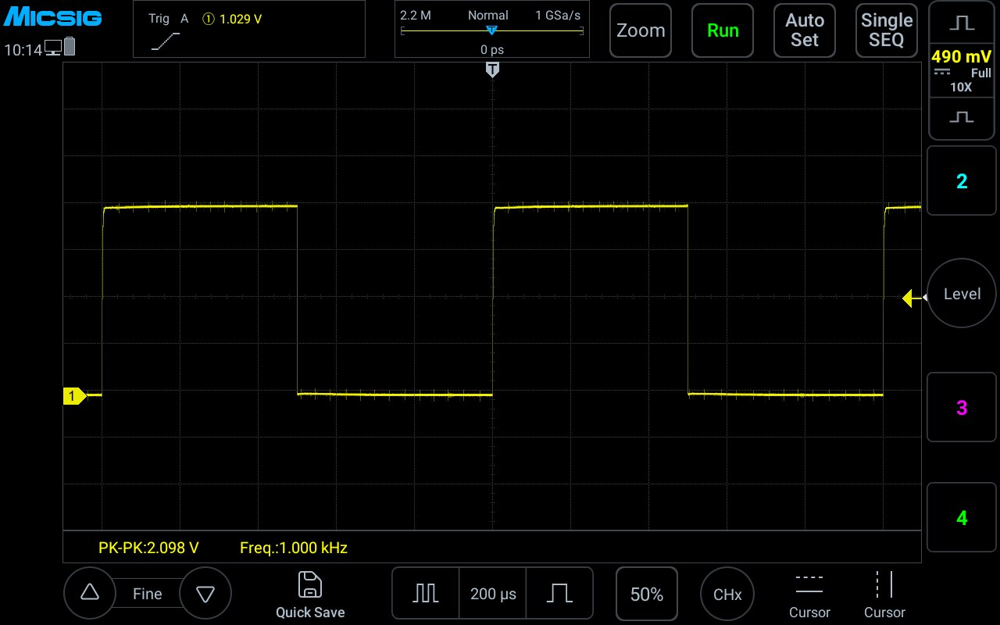

# micsig-rs

[](https://github.com/tralamazza/micsig-rs/actions/workflows/ci.yml)

Command-line tool to interface with a Micsig oscilloscope over SCPI (USB, LAN,
WiFi). Capture the screen, pull waveforms out as CSV, read the serial bus
decoder and the built-in measurements, or just send raw SCPI. Commands are
drawn from the vendor's [SCPI Programming Guide][guide], a copy of which is
[vendored in this repo](docs/SCPI%20Programming%20Guide-%20Micsig%20Oscilloscope.pdf).

[guide]: https://www.micsig.com/uploads/20260806/1cf4f626caf3eecee6cee1145a80762f.pdf



Above: `micsig screenshot` output, unmodified, with CH1 on the probe
compensation output — a 1 kHz square wave, 2.098 V pk-pk. The file is only
viewable because the tool repairs the firmware's broken JFIF marker, which is
one of a dozen-odd behaviours documented in
[Firmware quirks](docs/firmware-quirks.md).

## Build

```
cargo build --release      # binary at target/release/micsig
cargo install --path .     # or install it onto your PATH
```

## Platform support

| Platform | Status |
|---|---|
| macOS (aarch64) | Verified end-to-end against an MHO14-200N over USBTMC |
| Linux (aarch64, Ubuntu 26.04) | Builds, all tests pass; USB data path untested (no device) |
| Windows | Builds and all tests pass in CI; USB data path untested (no device) |

CI runs the test suite on all three, but no runner has an instrument attached,
so "tests pass" says nothing about the USB data path on Linux or Windows.

There are no `cfg(target_os)` branches in the source; the only platform-specific
dependency is libusb. Requires Rust 1.88 or newer.

Linux needs a udev rule before libusb can open the device, and interacts with
the in-tree `usbtmc` driver — see [Linux setup](docs/linux-setup.md).

## Usage

```
micsig [connection options] <command> [command options]
```

### Connecting

Connection options are global and may appear before or after the subcommand:

| Option | Meaning |
|---|---|
| `-u`, `--usb` | Force USBTMC |
| `-a`, `--address <HOST>` | Force TCP to an IP or hostname |
| `-p`, `--port <PORT>` | TCP port for `--address` (default `5025`) |
| `-t`, `--timeout <T>` | `3`, `0.5`, `2s`, `500ms`; per-command default if unset |

With neither `--usb` nor `--address`, the USB bus is searched for a Micsig
instrument, so a USB-attached scope needs no flags at all. `--usb` and
`--address` are mutually exclusive.

```
micsig scpi "*IDN?"                 # auto: finds the USB scope
micsig -u scpi "*IDN?"              # force USB
micsig -a 10.0.0.5 scpi "*IDN?"     # force TCP
```

### `scpi` — send a command

```
micsig scpi [-x] [-i] <scpi-command>
```

`-x/--hex` prints the response as a hex dump; `-i/--interactive` starts a repl
(and cannot be combined with a command).

```
micsig scpi "*IDN?"
micsig scpi -x ":WAVeform:PREamble?"
micsig scpi -i
```

### `screenshot` — capture the screen

```
micsig screenshot [--file <name>]
```

Writes the image captured via `:SYS:SCR?` (JFIF/JPEG on the MHO series, despite
the manual calling it PNG). Without `--file`, the image is saved to
`screenshot_<target>_<timestamp>.jpg`, where `<target>` is the address or
`usb`. Use `--file -` for stdout. The image at the top of this page is one,
unmodified.

Asked again too soon the scope returns an empty block instead of an image, so
`screenshot` retries up to five times at 700 ms intervals. Six back-to-back
captures all succeed; before the retry, five of those six failed. An
instrument that stays busy is reported as an error rather than written out as
a zero-byte file.

### `waveform` — capture channel data

```
micsig waveform [--channel <1-4>] [--mode <normal|maximum|raw>] [--file <name>]
```

Sets `:WAVeform:SOURce` and `:WAVeform:FORMat`, reads `:WAVeform:PREamble?`,
then writes `:WAVeform:MODE` and reads `:WAVeform:DATA?` repeatedly until the
instrument returns an empty block. Samples (binary or ASCII-hex, auto-detected)
are scaled to volts from the preamble and emitted as CSV
(`sample,time_s,voltage_v`) to stdout, or to `--file`.

The repeated read matters: each response is capped at 62500 samples, and the
next call continues from where the last stopped. A single read therefore
returns only part of the record — 62500 of 110000 in `normal` mode. Writing
`:WAVeform:MODE` rewinds that cursor, which is why it is sent last.

The manual says `--mode raw` requires a stopped scope; it returned data while
running too. What `raw` does change is the length: with the scope stopped at
1 ms/div (`:ACQuire:DEPTh?` = 11 M) it yielded all 11,000,000 samples in 14 s
and a 409 MB CSV, against 110,000 in 0.13 s for `normal`. Ask for `raw`
deliberately — it is the file size rather than the wait that will surprise you.

### `benchmark` — measure request latency

```
micsig benchmark [--count <n>]
```

Sends `n` `*IDN?` requests and reports requests/second.

### `discover` — list instruments

```
micsig discover [--ports <p,...>]
```

With no `--address`, enumerates Micsig instruments on the USB bus with their
product name and serial. With `--address`, probes that host over TCP; `--ports`
overrides the single `--port` with a list.

```
micsig discover                              # USB bus
micsig discover -a 10.0.0.5                  # one TCP port
micsig discover -a 10.0.0.5 --ports 5025,111 # several
```

### `measure` — read the instrument's automatic measurements

```
micsig measure [--channel <1-4>] [--items <a,b,...> | --all] [--csv]
```

Lets the scope do the arithmetic. With no `--items` it reports a general set;
`--all` reports all 21 supported. Against the 1 kHz probe-compensation output:

```
$ micsig measure
  FREQ      1.0000 kHz
  PERiod    999.9964 us
  PKPK      2.0976 V
  AMP       1.9738 V
  MAX       2.0491 V
  MIN       -40.8293 mV
  MEAN      1.0047 V
  RMS       1.4069 V
  PDUTy     49.92 %
  RISetime  2.7145 us
  FALL      358.3628 ns
```

`--csv` emits `item,value,unit` with unscaled values, for piping. An item the
instrument cannot compute from the current trace shows as `--` rather than
being an error.

A reading is not a single query: each item has to be added with
`:MEASure:OPEN`, left ~200 ms to settle, then queried, and the instrument
holds at most ten open at once. `measure` handles all of that in batches of
ten and closes what it opened, so the scope is left as it was found.

### `decode` — read decoded serial bus frames

```
micsig decode [--bus <1|2>] [--file <name>]
```

Reads the scope's serial bus decoder (UART, LIN, SPI, CAN, IIC, 1553B, 429)
and emits CSV. The bus must already be configured on the instrument:

```
micsig scpi ":BUS1:TYPE UART"
micsig scpi ":BUS1:UART:RX CH1"
micsig scpi ":BUS1:UART:USERbaud 2000"
micsig scpi ":BUS1:DISPlay 1"
micsig decode
```

```
BeginX,EndX,Data,Color
0s,3.7ms,55,0xffadbdcc
4.2ms,8.7ms,55,0xffadbdcc
```

`:BUS<n>:MODE` selects the trade-off: `GRAP` timestamps each frame but only
reports what is on screen, while `TXT` drops the timestamps and reaches
further back into the capture (5 vs 25 frames from one acquisition here).

This is built on `:BUS<n>:DATA?`, which is **not in the programming guide** but
is implemented by the MHO series.

## Documentation

- **[Firmware quirks](docs/firmware-quirks.md)** — the dozen-plus instrument
  behaviours that contradict or are missing from the programming guide, each
  reproduced against hardware on two firmware versions. Read this before
  trusting anything the manual says about `:WAVeform:DATA?`.
- **[Transport and protocol notes](docs/protocol.md)** — how requests are
  framed over USBTMC and raw TCP, and the one known limitation (`waveform`
  over TCP) that is not worked around.
- **[SCPI-99 compliance](docs/scpi-compliance.md)** — measured against the
  actual standard. One of thirteen IEEE 488.2 mandated commands works, none of
  the eleven SCPI-required ones do, and there is no error queue. Useful if you
  are pointing generic SCPI tooling at this scope and wondering why it hangs.
- **[Linux setup](docs/linux-setup.md)** — libusb, the udev rule, and the
  in-tree `usbtmc` kernel driver.
- **[SCPI Programming Guide](docs/SCPI%20Programming%20Guide-%20Micsig%20Oscilloscope.pdf)**
  — Micsig's own reference, vendored unmodified.

## Testing

`cargo test` runs 46 tests and needs no instrument attached, which is what
lets CI run the whole suite on Linux, macOS and Windows. The workflow also
enforces `rustfmt` and `clippy`, and builds against the 1.88 MSRV.

Unit tests cover block-header and preamble parsing, sample decoding, USBTMC
header packing, timeout parsing, decode-record conversion, and the clap
definition itself (`Cli::command().debug_assert()`, which catches conflicting
flag definitions).

`tests/regression.rs` pins the behaviours that hardware testing found the hard
way, each against a scripted mock socket or a captured payload: EOF
mid-response, a block with no trailing terminator, hostname resolution in
`discover`, the sample-count length field, the JFIF marker repair across
several corrupt values, ASCii-volts detection, and text-versus-binary stdout
rendering. A scripted `FakeScope` covers the `:WAVeform:DATA?` paging: that
every page is drained, that `:WAVeform:MODE` is written after the rest of the
setup so the cursor starts at the beginning, and that a record which never
terminates is reported rather than silently truncated.

## License

Licensed under either of

- Apache License, Version 2.0 ([LICENSE-APACHE](LICENSE-APACHE) or
  <http://www.apache.org/licenses/LICENSE-2.0>)
- MIT license ([LICENSE-MIT](LICENSE-MIT) or
  <http://opensource.org/licenses/MIT>)

at your option.

`src/usb.rs` is derived from [`rust-usbtmc`](https://github.com/rogerioadris/rust-usbtmc)
(c) Rogério Adriano, also dual-licensed MIT OR Apache-2.0.

The programming guide under `docs/` is Micsig's copyright, not covered by the
above. It is redistributed unmodified as published by the vendor —
byte-identical to Micsig's published file, SHA-256 `f84fe826…76d8315` — and is
excluded from the packaged crate. The vendored copy is kept because the
upstream URL is content-addressed under a dated path and is likely to move.

This is the February 2026 edition. An earlier one circulates dated May 2024;
it is a strict subset, predating the `:SYS:SCR?`, `:WAVeform:DATA:<type>?`,
`:MENU:RESet` and `:MENU:AUX:TRIGger` sections, so there is no reason to
prefer it. Neither edition lists the MHO14 among its applicable models.

### Contribution

Unless you explicitly state otherwise, any contribution intentionally submitted
for inclusion in the work by you, as defined in the Apache-2.0 license, shall be
dual licensed as above, without any additional terms or conditions.
